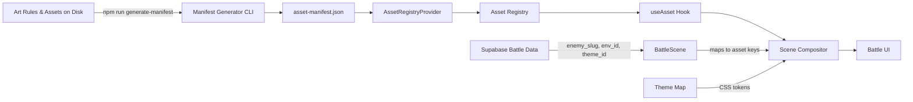
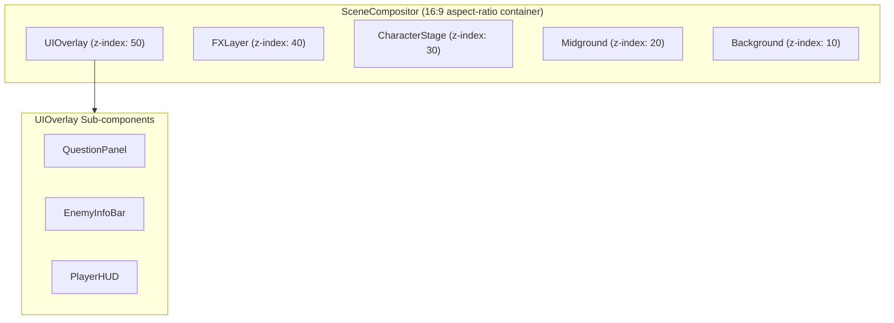

# Design Document: Fantasy Art System

## Overview

The Fantasy Art System provides the visual asset infrastructure for Engineero's battle experience. It introduces a pipeline that flows from art rules and asset files on disk, through a CLI manifest generator, into a typed asset registry, and finally into a layered React scene compositor that renders cinematic battle scenes.

The system spans three packages:

- `packages/types` — shared domain types for asset manifest entries, theme maps, layout contracts, and FX anchors
- `apps/web` — React components (SceneCompositor, layer components), hooks (useAsset), the asset registry module, theme CSS generation, and the manifest generator CLI
- `public/assets/` — the on-disk asset folder structure scanned by the manifest generator

Supabase provides semantic metadata (enemy slugs, environment IDs, theme IDs) but owns zero visual assets. React owns all rendering and composition.

### Key Design Decisions

1. **Static manifest over runtime scanning**: The manifest generator runs at build/dev time and produces a JSON file. The registry reads this JSON at runtime — no filesystem scanning in the browser.
2. **Semantic keys, not file paths**: All components reference assets via `AssetKey` strings (`enemy:fire_golem`, `env:dark_forest:night`). The registry resolves keys to paths.
3. **Layered composition via z-index stacking**: The SceneCompositor uses CSS absolute positioning within a 16:9 aspect-ratio container. Each layer is a discrete React component stacked via z-index.
4. **Graceful degradation by default**: Every asset category has a fallback. The `useAsset` hook automatically resolves fallbacks on error. The scene always renders.
5. **CSS custom properties for theming**: Theme token sets are applied as `--lh-*` CSS custom properties on the battle viewport container, inheriting to all descendants. This extends the existing `fantasy-ui.css` convention.

## Architecture

### System Pipeline



### Layer Architecture



### Package Boundary Map

```
packages/types/src/
  asset.ts          — AssetManifest, AssetEntry, AssetKey, AssetCategory types
  theme.ts          — ThemeMap, ThemeTokenSet, ThemeId types
  layout.ts         — LayoutContract, FXAnchor constants and types

apps/web/src/
  data/
    asset-manifest.json       — generated manifest (gitignored or committed)
  lib/
    asset-registry.ts         — AssetRegistry class: resolve, validate, preload, cache
  hooks/
    useAsset.ts               — React hook wrapping registry resolution + loading state
  contexts/
    AssetRegistryContext.ts   — React context + useAssetRegistry hook
    AssetRegistryProvider.tsx — Provider that loads manifest and creates AssetRegistry
  components/
    fantasy/
      BattleScene.tsx         — battle-data-to-scene wrapper, wraps with AssetRegistryProvider
      scene/
        index.ts              — barrel exports for all scene components and types
        SceneCompositor.tsx   — root 16:9 container, theme application, layer stacking
        Background.tsx        — background layer component
        Midground.tsx         — midground/parallax layer component
        CharacterStage.tsx    — enemy art display with layout contract positioning
        FXLayer.tsx           — effect rendering with anchor positioning
        UIOverlay.tsx         — HUD, enemy info, question panel mounting
  styles/
    themes/
      generate-theme-css.ts   — generateThemeCSS() and getThemeStyle() utilities
  scripts/
    generate-manifest.ts      — CLI manifest generator

public/assets/
  enemy/{slug}/               — enemy art files
  environment/{slug}/         — environment backgrounds
  effect/{slug}/              — effect overlays
  icon/{slug}/                — icon assets
  ui_frame/{slug}/            — UI frame assets
  overlay/{slug}/             — overlay assets
  fallback/                   — one fallback per category
```

## Components and Interfaces

### 1. Asset Types (`packages/types/src/asset.ts`)

```typescript
/** The six supported asset categories */
export type AssetCategory =
  | "enemy"
  | "environment"
  | "effect"
  | "icon"
  | "ui_frame"
  | "overlay";

/** Variant category types */
export type PoseVariant = "idle" | "attack" | "hurt" | "defeated";
export type LightingVariant = "day" | "night" | "dramatic";
export type PaletteVariant = string; // open-ended recolor names
export type VariantCategory = "pose" | "lighting" | "palette";

export interface VariantTag {
  category: VariantCategory;
  value: string;
}

/** Optional animation metadata for sprite sheets / future animation support */
export interface AnimationMeta {
  frameCount: number;
  frameDuration: number; // ms per frame
  loop: boolean;
}

/**
 * A single entry in the asset manifest.
 * AssetKey format: `{category}:{slug}` or `{category}:{slug}:{variant}`
 */
export interface AssetEntry {
  assetKey: string;
  filePath: string;
  width: number;
  height: number;
  category: AssetCategory;
  variants?: VariantTag[];
  animation?: AnimationMeta;
}

/** Top-level asset manifest structure */
export interface AssetManifest {
  schemaVersion: number;
  generatedAt: string; // ISO 8601
  entries: AssetEntry[];
}

/** Asset key regex pattern: {category}:{slug} or {category}:{slug}:{variant} */
export const ASSET_KEY_PATTERN =
  /^(enemy|environment|effect|icon|ui_frame|overlay):([a-z0-9_]+)(?::([a-z0-9_]+))?$/;

/** Valid image extensions per category */
export const CATEGORY_FORMATS: Record<AssetCategory, string[]> = {
  enemy: ["png"],
  environment: ["webp"],
  effect: ["png", "webp"],
  icon: ["png"],
  ui_frame: ["png"],
  overlay: ["png", "webp"],
};

/** Recognized variant values per variant category */
export const RECOGNIZED_VARIANTS: Record<VariantCategory, string[]> = {
  pose: ["idle", "attack", "hurt", "defeated"],
  lighting: ["day", "night", "dramatic"],
  palette: [], // open-ended, no validation
};

/** Default variant per variant category (used for fallback) */
export const DEFAULT_VARIANTS: Record<VariantCategory, string> = {
  pose: "idle",
  lighting: "day",
  palette: "default",
};
```

### 2. Theme Types (`packages/types/src/theme.ts`)

```typescript
/** Required CSS custom property keys for a theme token set */
export interface ThemeTokenSet {
  "--lh-accent-primary": string;
  "--lh-accent-secondary": string;
  "--lh-panel-bg": string;
  "--lh-panel-border": string;
  "--lh-border-glow": string;
  "--lh-text-primary": string;
  "--lh-text-secondary": string;
  "--lh-text-accent": string;
}

/** Theme identifier type */
export type ThemeId = string;

/** Theme map: theme identifier → token set */
export type ThemeMap = Record<ThemeId, ThemeTokenSet>;

/** The default theme ID applied when no theme is specified or the specified theme is missing */
export const DEFAULT_THEME_ID: ThemeId = "default";

/** Default theme token set — dark fantasy baseline matching existing fantasy-ui.css */
export const DEFAULT_THEME_TOKENS: ThemeTokenSet = {
  "--lh-accent-primary": "#f2c94c",
  "--lh-accent-secondary": "#ff7a18",
  "--lh-panel-bg": "rgba(13, 24, 38, 0.96)",
  "--lh-panel-border": "rgba(255, 255, 255, 0.08)",
  "--lh-border-glow": "rgba(242, 201, 76, 0.25)",
  "--lh-text-primary": "#f3f6ff",
  "--lh-text-secondary": "#9db2d1",
  "--lh-text-accent": "#f2c94c",
};

/** Built-in theme map with at least the default theme */
export const THEME_MAP: ThemeMap = {
  [DEFAULT_THEME_ID]: DEFAULT_THEME_TOKENS,
};
```

### 3. Layout Contract (`packages/types/src/layout.ts`)

```typescript
/** Percentage-based rectangle within the 16:9 viewport */
export interface LayoutZone {
  x: number; // left edge as % of viewport width
  y: number; // top edge as % of viewport height
  width: number; // zone width as % of viewport width
  height: number; // zone height as % of viewport height
}

/** Complete layout contract for the battle viewport */
export interface LayoutContractType {
  background: LayoutZone;
  midground: LayoutZone;
  characterStage: LayoutZone;
  fxOverlay: LayoutZone;
  uiOverlay: LayoutZone;
  enemyDisplay: LayoutZone;
  questionPanel: LayoutZone;
  enemyInfoBar: LayoutZone;
  playerHUD: LayoutZone;
}

export const LAYOUT_CONTRACT: LayoutContractType = {
  background: { x: 0, y: 0, width: 100, height: 100 },
  midground: { x: 0, y: 40, width: 100, height: 60 },
  characterStage: { x: 25, y: 30, width: 50, height: 70 },
  fxOverlay: { x: 0, y: 0, width: 100, height: 100 },
  uiOverlay: { x: 0, y: 0, width: 100, height: 100 },
  enemyDisplay: { x: 30, y: 20, width: 40, height: 60 },
  questionPanel: { x: 5, y: 70, width: 90, height: 30 },
  enemyInfoBar: { x: 20, y: 0, width: 60, height: 10 },
  playerHUD: { x: 0, y: 85, width: 20, height: 15 },
};

/** Named FX anchor points */
export type FXAnchorName =
  | "enemy_center"
  | "enemy_top"
  | "player_side"
  | "screen_center"
  | "screen_full";

export interface FXAnchorPosition {
  x: number;
  y: number;
  fillViewport?: boolean;
}

export const FX_ANCHORS: Record<FXAnchorName, FXAnchorPosition> = {
  enemy_center: { x: 50, y: 50 },
  enemy_top: { x: 50, y: 20 },
  player_side: { x: 12, y: 85 },
  screen_center: { x: 50, y: 50 },
  screen_full: { x: 50, y: 50, fillViewport: true },
};

export const DEFAULT_FX_ANCHOR: FXAnchorName = "screen_center";
```

### 4. Asset Registry (`apps/web/src/lib/asset-registry.ts`)

```typescript
import type {
  AssetManifest,
  AssetEntry,
  AssetCategory,
} from "@legendary-hunts/types";

export interface ResolvedAsset {
  src: string;
  width: number;
  height: number;
  entry: AssetEntry;
}

export interface PreloadProgress {
  total: number;
  loaded: number;
  fraction: number;
}

export class AssetRegistry {
  private manifest: AssetManifest;
  private cache: Map<string, ResolvedAsset>;
  private imageCache: Map<string, HTMLImageElement>;
  private fallbacks: Map<AssetCategory, AssetEntry>;

  constructor(manifest: AssetManifest);

  /** Resolve an asset key to a file path, dimensions, and metadata */
  resolve(assetKey: string, variant?: string): ResolvedAsset | null;

  /** Get the fallback asset for a given category */
  getFallback(category: AssetCategory): ResolvedAsset;

  /** Resolve with automatic fallback — never returns null */
  resolveWithFallback(assetKey: string, variant?: string): ResolvedAsset;

  /** Validate that all manifest file paths correspond to loadable assets */
  validate(): Promise<{ valid: boolean; errors: string[] }>;

  /** Preload an array of asset keys, returning progress updates via callback */
  preload(
    assetKeys: string[],
    onProgress?: (progress: PreloadProgress) => void,
  ): Promise<void>;

  /** Check if an asset is already cached */
  isCached(assetKey: string): boolean;

  /** Get available variants for an asset slug */
  getVariants(baseKey: string): AssetEntry[];
}
```

### 5. useAsset Hook (`apps/web/src/hooks/useAsset.ts`)

```typescript
export type AssetStatus = "loading" | "loaded" | "error";

export interface UseAssetResult {
  src: string | null;
  status: AssetStatus;
  width: number;
  height: number;
  error: string | null;
}

export interface UseAssetOptions {
  variant?: string;
}

/**
 * React hook that resolves an asset key to a loaded image.
 * Integrates with AssetRegistry preload cache.
 * On error, automatically resolves the category-appropriate fallback.
 */
export function useAsset(
  assetKey: string,
  options?: UseAssetOptions,
): UseAssetResult;
```

### 6. Scene Compositor Component Tree (`apps/web/src/components/fantasy/scene/`)

```typescript
// SceneCompositor.tsx
export interface SceneCompositorProps {
  environmentKey?: string;
  enemyKey?: string;
  effects?: EffectDescriptor[];
  themeId?: string;
  midgroundKey?: string;
  children?: React.ReactNode;
  className?: string;
}

export interface EffectDescriptor {
  assetKey: string;
  anchor: FXAnchorName;
  duration?: number; // ms, defaults to 800
  id: string;
}

export function SceneCompositor(props: SceneCompositorProps): JSX.Element;

// Background.tsx
export interface BackgroundProps {
  assetKey: string;
  zone: LayoutZone;
}
export function Background(props: BackgroundProps): JSX.Element;

// Midground.tsx
export interface MidgroundProps {
  assetKey?: string;
  zone: LayoutZone;
}
export function Midground(props: MidgroundProps): JSX.Element;

// CharacterStage.tsx
export interface CharacterStageProps {
  enemyKey?: string;
  enemyVariant?: string;
  zone: LayoutZone;
  enemyDisplayZone: LayoutZone;
}
export function CharacterStage(props: CharacterStageProps): JSX.Element;

// FXLayer.tsx
export interface FXLayerProps {
  effects: EffectDescriptor[];
  zone: LayoutZone;
}
export function FXLayer(props: FXLayerProps): JSX.Element;

// UIOverlay.tsx
export interface UIOverlayProps {
  children?: React.ReactNode;
  zone: LayoutZone;
}
export function UIOverlay(props: UIOverlayProps): JSX.Element;
```

### 7. Manifest Generator (`apps/web/src/scripts/generate-manifest.ts`)

```typescript
export interface GeneratorOptions {
  assetsDir: string; // default: 'public/assets'
  outputPath: string; // default: 'apps/web/src/data/asset-manifest.json'
  existingManifestPath?: string;
}

export interface GeneratorResult {
  manifest: AssetManifest;
  warnings: string[];
  orphanedKeys: string[];
}

/** Scan asset directories and produce a valid AssetManifest */
export async function generateManifest(
  options: GeneratorOptions,
): Promise<GeneratorResult>;

/** CLI entry point */
export async function main(): Promise<void>;
```
