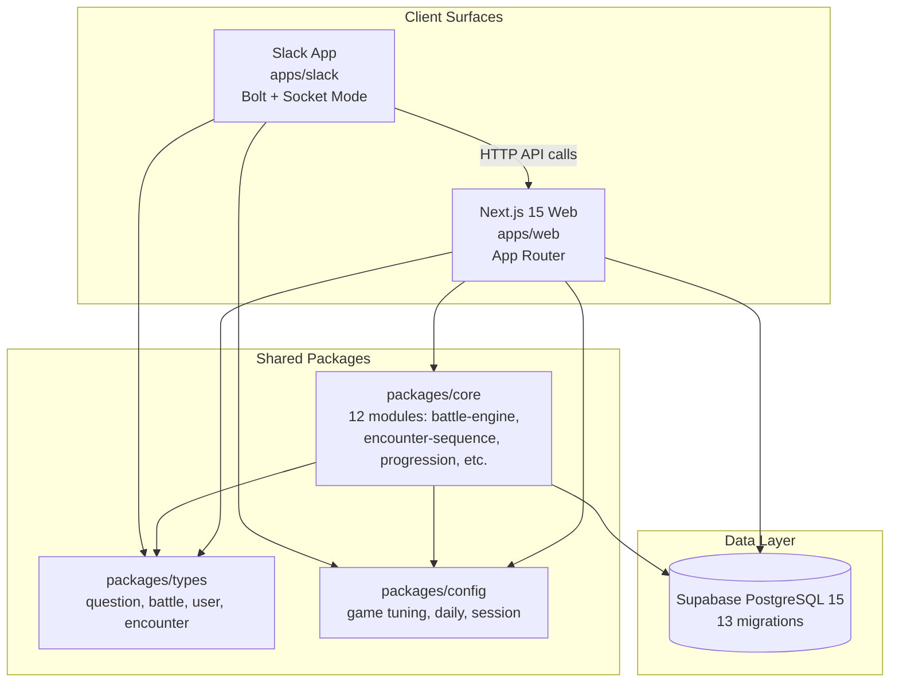
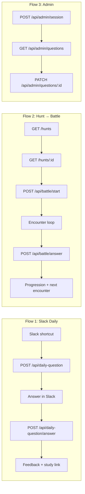
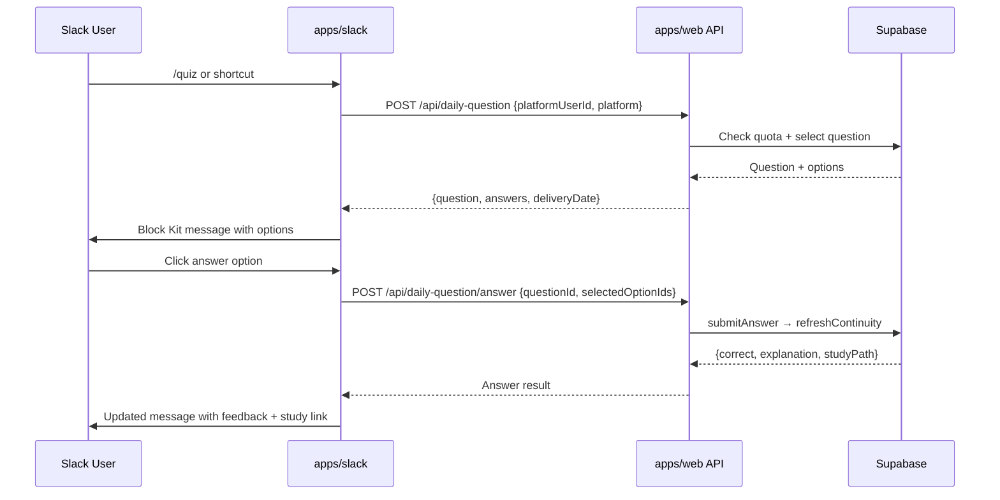
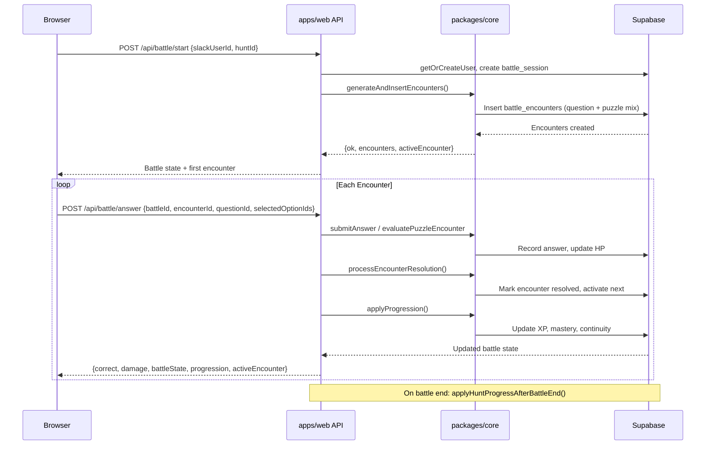
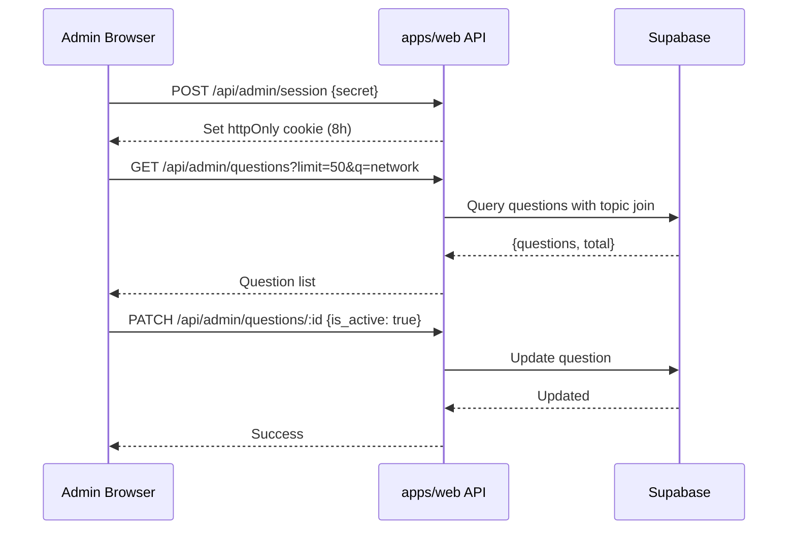

# Design Document: MVP Readiness

## Overview

Engineero is a Slack-first gamified learning platform with a Next.js web companion, built as a pnpm/Turborepo monorepo. Phases 1–4 are complete (scaffold, core infra, Slack daily questions, game core with encounters). Phase 5 is partial (admin question review done; import pipeline incomplete). Phase 6 (progression trophies, badges, items, cooldowns) is pending.

This MVP Readiness spec defines the smallest demoable vertical slice that proves the product works end-to-end: local startup → Slack daily quiz → hunt browsing → battle with encounters → answer submission with progression → admin content management. It catalogs every known blocker, validates each critical flow against repo reality, and produces a prioritized implementation order that maximizes demo coverage with minimal risk.

The goal is not to ship a polished product but to reach a state where a stakeholder can walk through the full loop — Slack question → web battle → progression update → admin review — on a local environment without hitting schema errors, auth failures, or dead routes.

## Architecture



### MVP Flow Architecture



## Sequence Diagrams

### Flow 1: Slack Daily Question



### Flow 2: Battle Encounter Loop



### Flow 3: Admin Question Management



## Components and Interfaces

### Component 1: Local Startup Validator

**Purpose**: Validates that all prerequisites for local development are met — env vars, Supabase local, migrations applied, seed data present, and all three dev servers (web, slack, supabase) can start.

**Interface**:

```typescript
interface StartupValidation {
  checkEnvVars(): EnvCheckResult;
  checkSupabaseLocal(): SupabaseCheckResult;
  checkMigrations(): MigrationCheckResult;
  checkSeedData(): SeedCheckResult;
}

type EnvCheckResult = {
  valid: boolean;
  missing: string[];
  warnings: string[];
};

type SupabaseCheckResult = {
  running: boolean;
  port: number;
  studioPort: number;
};

type MigrationCheckResult = {
  applied: string[];
  pending: string[];
  critical: string[];
};

type SeedCheckResult = {
  hasCertification: boolean;
  hasQuestions: boolean;
  hasHunts: boolean;
  hasPuzzles: boolean;
};
```

**Responsibilities**:

- Validate `.env.local` contains all required vars (including the 3 missing Supabase vars)
- Confirm `supabase start` is running and healthy
- Confirm all 13 migrations are applied locally
- Confirm seed data exists for a walkthrough demo

### Component 2: Blocker Matrix

**Purpose**: Tracks every known issue that prevents a specific MVP flow from completing, with severity and resolution path.

**Interface**:

```typescript
type BlockerSeverity = "hard" | "soft" | "cosmetic";

interface Blocker {
  id: string;
  description: string;
  severity: BlockerSeverity;
  affectedFlows: MVPFlow[];
  resolution: string;
  effort: "low" | "medium" | "high";
  owner: "web" | "slack" | "core" | "supabase" | "docs" | "infra";
}

type MVPFlow =
  | "local-startup"
  | "slack-daily"
  | "hunt-detail"
  | "battle-start"
  | "answer-submission"
  | "progression"
  | "admin-content"
  | "battle-ui";
```

**Responsibilities**:

- Enumerate all blockers from repo intake + known issues
- Map each blocker to affected MVP flows
- Provide resolution path and effort estimate

### Component 3: Flow Validator

**Purpose**: Defines the acceptance criteria for each of the 8 MVP flows and provides a manual + automated validation checklist.

**Interface**:

```typescript
interface FlowValidation {
  flow: MVPFlow;
  preconditions: string[];
  steps: ValidationStep[];
  expectedOutcome: string;
  acceptanceCriteria: string[];
}

interface ValidationStep {
  action: string;
  expectedResult: string;
  apiEndpoint?: string;
  uiRoute?: string;
}
```

**Responsibilities**:

- Define step-by-step validation for each MVP flow
- Specify preconditions (env, data, services)
- Define pass/fail criteria

## Data Models

### Model 1: MVP Blocker Registry

```typescript
const MVP_BLOCKERS: Blocker[] = [
  {
    id: "B-001",
    description:
      "Remote Supabase missing migration 010+ (battle_encounters table)",
    severity: "hard",
    affectedFlows: ["battle-start", "answer-submission", "battle-ui"],
    resolution: "Run pnpm db:push against linked Supabase project",
    effort: "low",
    owner: "supabase",
  },
  {
    id: "B-002",
    description: "No proper web auth — relies on slack_user_id query param",
    severity: "soft",
    affectedFlows: [
      "hunt-detail",
      "battle-start",
      "answer-submission",
      "progression",
      "battle-ui",
    ],
    resolution: "Acceptable for local MVP demo; document as known limitation",
    effort: "low",
    owner: "web",
  },
  {
    id: "B-003",
    description: "No test suite exists across entire monorepo",
    severity: "soft",
    affectedFlows: ["local-startup"],
    resolution:
      "Add vitest + smoke tests for core answer-evaluation and encounter-sequence",
    effort: "medium",
    owner: "core",
  },
  {
    id: "B-004",
    description: "INTERNAL_API_SECRET not enforced on daily-question routes",
    severity: "soft",
    affectedFlows: ["slack-daily"],
    resolution:
      "Add middleware check when INTERNAL_API_SECRET is set; skip in dev",
    effort: "low",
    owner: "web",
  },
  {
    id: "B-005",
    description: "Legacy /api/battles/* routes still present (no callers)",
    severity: "cosmetic",
    affectedFlows: ["battle-start", "answer-submission"],
    resolution: "Delete apps/web/src/app/api/battles/ directory",
    effort: "low",
    owner: "web",
  },
  {
    id: "B-006",
    description: "HP cooldown not enforced in battle start or progression",
    severity: "soft",
    affectedFlows: ["battle-start", "progression"],
    resolution: "Defer to Phase 6; document as known gap",
    effort: "medium",
    owner: "core",
  },
  {
    id: "B-007",
    description:
      "Slack FileInstallationStore uses disk — won't work serverless",
    severity: "soft",
    affectedFlows: ["slack-daily"],
    resolution:
      "Acceptable for local MVP; document migration path to Supabase store",
    effort: "medium",
    owner: "slack",
  },
  {
    id: "B-008",
    description: "Missing Supabase env vars in .env.example",
    severity: "hard",
    affectedFlows: ["local-startup"],
    resolution:
      "Add NEXT_PUBLIC_SUPABASE_URL, NEXT_PUBLIC_SUPABASE_ANON_KEY, SUPABASE_SERVICE_ROLE_KEY",
    effort: "low",
    owner: "docs",
  },
  {
    id: "B-009",
    description:
      "docs/getting-started.md outdated (npm placeholders, no Supabase local steps)",
    severity: "hard",
    affectedFlows: ["local-startup"],
    resolution:
      "Rewrite with pnpm install, supabase start, env setup, migration push",
    effort: "low",
    owner: "docs",
  },
  {
    id: "B-010",
    description:
      "Slack env vars documented as optional but required by apps/slack/src/env.ts",
    severity: "hard",
    affectedFlows: ["local-startup", "slack-daily"],
    resolution:
      "Update .env.example to mark Slack vars as required with setup instructions",
    effort: "low",
    owner: "docs",
  },
];
```

**Validation Rules**:

- Every `hard` blocker must be resolved before MVP demo
- Every `soft` blocker must have a documented workaround or deferral rationale
- `cosmetic` blockers are nice-to-fix but not gating

### Model 2: MVP Dependency Checklist

```typescript
interface DependencyCheck {
  category: string;
  item: string;
  status: "present" | "missing" | "outdated";
  action: string;
}

const MVP_DEPENDENCIES: DependencyCheck[] = [
  // Runtime
  {
    category: "runtime",
    item: "Node.js 18+",
    status: "present",
    action: "Verify with node -v",
  },
  {
    category: "runtime",
    item: "pnpm 10+",
    status: "present",
    action: "Verify with pnpm -v",
  },
  {
    category: "runtime",
    item: "Supabase CLI",
    status: "present",
    action: "supabase --version",
  },
  {
    category: "runtime",
    item: "Docker (for Supabase local)",
    status: "present",
    action: "docker info",
  },

  // Env vars — web
  {
    category: "env",
    item: "NEXT_PUBLIC_APP_URL",
    status: "present",
    action: "In .env.example",
  },
  {
    category: "env",
    item: "NEXT_PUBLIC_SUPABASE_URL",
    status: "missing",
    action: "Add to .env.example",
  },
  {
    category: "env",
    item: "NEXT_PUBLIC_SUPABASE_ANON_KEY",
    status: "missing",
    action: "Add to .env.example",
  },
  {
    category: "env",
    item: "SUPABASE_SERVICE_ROLE_KEY",
    status: "missing",
    action: "Add to .env.example",
  },
  {
    category: "env",
    item: "ADMIN_API_SECRET",
    status: "present",
    action: "In .env.example",
  },
  {
    category: "env",
    item: "INTERNAL_API_SECRET",
    status: "present",
    action: "In .env.example",
  },

  // Env vars — slack
  {
    category: "env",
    item: "SLACK_BOT_TOKEN",
    status: "outdated",
    action: "Mark required",
  },
  {
    category: "env",
    item: "SLACK_SIGNING_SECRET",
    status: "outdated",
    action: "Mark required",
  },
  {
    category: "env",
    item: "SLACK_APP_TOKEN",
    status: "outdated",
    action: "Mark required",
  },

  // Database
  {
    category: "database",
    item: "Supabase local running",
    status: "present",
    action: "supabase start",
  },
  {
    category: "database",
    item: "All 13 migrations applied",
    status: "present",
    action: "supabase db reset",
  },
  {
    category: "database",
    item: "Network+ seed data",
    status: "present",
    action: "Migration 007 + 011",
  },

  // Build
  {
    category: "build",
    item: "pnpm typecheck passes",
    status: "present",
    action: "pnpm typecheck",
  },
  {
    category: "build",
    item: "pnpm build passes",
    status: "present",
    action: "pnpm build",
  },
  {
    category: "build",
    item: "pnpm lint passes",
    status: "present",
    action: "pnpm lint",
  },
];
```

## Key Functions with Formal Specifications

### Function 1: validateLocalStartup()

```typescript
async function validateLocalStartup(): Promise<StartupValidation>;
```

**Preconditions:**

- Process has access to filesystem (`.env.local`, `supabase/config.toml`)
- Docker daemon is running (required for Supabase local)
- `pnpm install` has been run (node_modules exist)

**Postconditions:**

- Returns complete `StartupValidation` with all four check results populated
- Each check result accurately reflects current system state
- No side effects — read-only validation

### Function 2: resolveBlockersForFlow()

```typescript
function resolveBlockersForFlow(
  flow: MVPFlow,
  blockers: Blocker[],
): { hardBlockers: Blocker[]; softBlockers: Blocker[]; cosmetic: Blocker[] };
```

**Preconditions:**

- `flow` is a valid `MVPFlow` value
- `blockers` is the complete blocker registry

**Postconditions:**

- Returns blockers partitioned by severity for the given flow
- `hardBlockers.length === 0` implies the flow is unblocked for MVP demo
- Union of all three arrays equals all blockers where `affectedFlows.includes(flow)`

### Function 3: validateFlowEndToEnd()

```typescript
async function validateFlowEndToEnd(
  flow: MVPFlow,
  config: { supabaseUrl: string; slackUserId: string; adminSecret: string },
): Promise<{ passed: boolean; failedStep?: ValidationStep; error?: string }>;
```

**Preconditions:**

- Supabase local is running with all migrations applied
- Web app dev server is running on port 3000
- For slack-daily flow: Slack app is running with valid tokens
- `config.slackUserId` resolves to an existing user (or will be auto-created)

**Postconditions:**

- Returns `passed: true` if all steps in the flow validation complete successfully
- Returns `passed: false` with `failedStep` and `error` if any step fails
- No destructive side effects beyond normal flow execution (creates battle sessions, answers, etc.)

## Algorithmic Pseudocode

### MVP Validation Algorithm

```typescript
// ALGORITHM: Full MVP validation sweep
// INPUT: environment config, blocker registry
// OUTPUT: MVPReadinessReport

async function runMVPValidation(
  env: EnvironmentConfig,
  blockers: Blocker[],
): Promise<MVPReadinessReport> {
  // Step 1: Validate local startup prerequisites
  const startup = await validateLocalStartup();

  // Step 2: Partition blockers by severity
  const hardBlockers = blockers.filter((b) => b.severity === "hard");
  const unresolvedHard = hardBlockers.filter((b) => !isResolved(b, startup));

  // Step 3: Validate each MVP flow in dependency order
  const flowOrder: MVPFlow[] = [
    "local-startup", // must pass first
    "slack-daily", // independent of web battle flows
    "hunt-detail", // read-only, low risk
    "battle-start", // depends on migrations 010+
    "answer-submission", // depends on battle-start
    "progression", // depends on answer-submission
    "admin-content", // independent of learner flows
    "battle-ui", // depends on battle-start + answer-submission
  ];

  const results: Map<MVPFlow, FlowResult> = new Map();

  for (const flow of flowOrder) {
    const flowBlockers = resolveBlockersForFlow(flow, blockers);
    if (flowBlockers.hardBlockers.length > 0) {
      results.set(flow, {
        status: "blocked",
        blockers: flowBlockers.hardBlockers,
      });
      continue;
    }
    const result = await validateFlowEndToEnd(flow, env);
    results.set(flow, {
      status: result.passed ? "pass" : "fail",
      failedStep: result.failedStep,
      error: result.error,
    });
  }

  // Step 4: Compute overall readiness
  const allPassed = [...results.values()].every((r) => r.status === "pass");

  return {
    ready: allPassed,
    startup,
    flowResults: results,
    unresolvedBlockers: unresolvedHard,
    timestamp: new Date().toISOString(),
  };
}
```

**Preconditions:**

- Environment config contains valid Supabase URL, Slack user ID, admin secret
- Blocker registry is complete and up-to-date

**Postconditions:**

- Report accurately reflects current system state
- `ready === true` only if all 8 flows pass validation
- Each flow result includes specific failure details if applicable

**Loop Invariants:**

- All previously validated flows retain their results
- Flow order respects dependency chain

### Implementation Priority Algorithm

```typescript
// ALGORITHM: Determine optimal implementation order
// INPUT: blocker registry, flow dependency graph
// OUTPUT: ordered task list maximizing unblocked flows per task

function computeImplementationOrder(blockers: Blocker[]): ImplementationTask[] {
  const hardByImpact = blockers
    .filter((b) => b.severity === "hard")
    .sort((a, b) => {
      const flowDiff = b.affectedFlows.length - a.affectedFlows.length;
      if (flowDiff !== 0) return flowDiff;
      const effortRank = { low: 0, medium: 1, high: 2 };
      return effortRank[a.effort] - effortRank[b.effort];
    });

  const softOnCriticalPath = blockers
    .filter((b) => b.severity === "soft")
    .filter((b) =>
      b.affectedFlows.some((f) =>
        ["battle-start", "answer-submission", "progression"].includes(f),
      ),
    );

  const cosmetic = blockers.filter((b) => b.severity === "cosmetic");

  return [
    ...hardByImpact.map(toTask),
    ...softOnCriticalPath.map(toTask),
    ...cosmetic.map(toTask),
  ];
}
```

**Preconditions:**

- Blocker registry is complete
- Each blocker has accurate severity, effort, and affectedFlows

**Postconditions:**

- Returned list is ordered by maximum MVP impact per unit effort
- Hard blockers always precede soft blockers
- Soft blockers on critical path precede cosmetic issues

## Example Usage

### Example 1: Running MVP Validation Locally

```typescript
// After: pnpm install && supabase start && supabase db reset
const report = await runMVPValidation(
  {
    supabaseUrl: "http://localhost:54321",
    slackUserId: "U_TEST_USER",
    adminSecret: process.env.ADMIN_API_SECRET!,
  },
  MVP_BLOCKERS,
);

if (!report.ready) {
  console.log("Unresolved blockers:");
  for (const b of report.unresolvedBlockers) {
    console.log(`  [${b.severity}] ${b.id}: ${b.description}`);
  }
}
```

### Example 2: Checking a Single Flow

```typescript
const battleResult = await validateFlowEndToEnd("battle-start", {
  supabaseUrl: "http://localhost:54321",
  slackUserId: "U_TEST_USER",
  adminSecret: "",
});

if (!battleResult.passed) {
  console.log(`Failed at: ${battleResult.failedStep?.action}`);
  // Common: "relation battle_encounters does not exist" → migration 010 not applied
}
```

### Example 3: Getting Implementation Priority

```typescript
const tasks = computeImplementationOrder(MVP_BLOCKERS);
// Output order:
// 1. [low] Add missing Supabase env vars to .env.example → unblocks: local-startup
// 2. [low] Rewrite docs/getting-started.md → unblocks: local-startup
// 3. [low] Update .env.example Slack vars → unblocks: local-startup, slack-daily
// 4. [low] Apply migrations 010-013 to remote → unblocks: battle-start, answer-submission, battle-ui
// 5. [low] Delete legacy /api/battles/* → unblocks: battle-start, answer-submission (clarity)
// 6. [low] Enforce INTERNAL_API_SECRET → unblocks: slack-daily
// 7. [medium] Add vitest smoke tests → unblocks: local-startup (CI test job)
// 8. [medium] Defer HP cooldown → document gap → unblocks: battle-start, progression
// 9. [medium] Document FileInstallationStore migration → unblocks: slack-daily (deploy)
// 10. [low] Delete legacy routes → cosmetic cleanup
```

## Correctness Properties

_A property is a characteristic or behavior that should hold true across all valid executions of a system — essentially, a formal statement about what the system should do. Properties serve as the bridge between human-readable specifications and machine-verifiable correctness guarantees._

### Property 1: Encounter generation produces valid counts

_For any_ valid battle type, `generateAndInsertEncounters` must produce a number of encounters within `[ENCOUNTER_STEP_RANGE[battleType].min, ENCOUNTER_STEP_RANGE[battleType].max]` inclusive, and each encounter must have a type of either `question` or `puzzle_step`.

**Validates: Requirements 6.3, 6.4**

### Property 2: Encounter state transition integrity

_For any_ battle with N encounters and any answer submission for encounter K (where 1 <= K <= N), `processEncounterResolution` must transition exactly one encounter from `active` to `resolved` and, if K < N, activate the next `pending` encounter. If K = N, the battle session must be marked complete.

**Validates: Requirements 7.3, 7.4**

### Property 3: Answer evaluation correctness

_For any_ question with a defined correct answer set and any user-selected option set, `submitAnswer` must return `correct: true` if and only if the selected options exactly match the correct answer set.

**Validates: Requirement 7.2**

### Property 4: Timeout forces incorrect

_For any_ encounter where the elapsed time between `started_at` and submission time exceeds `GAME_CONFIG.timeoutSeconds`, the answer must be evaluated as incorrect regardless of the selected options.

**Validates: Requirement 7.5**

### Property 5: Progression completeness after answer

_For any_ answer submission (correct or incorrect) at any difficulty tier, `applyProgression` must update all three progression dimensions: XP (by the amount specified in `XP_BY_DIFFICULTY[tier]`), topic mastery score for the relevant topic, and knowledge continuity streak.

**Validates: Requirements 8.1, 8.2, 8.3**

### Property 6: Daily question quota enforcement

_For any_ user who has received N questions on a given day where N >= the configured `questions_per_day` quota (default 5), `canReceiveQuestion` must return `false`.

**Validates: Requirement 4.4**

### Property 7: Admin route authentication enforcement

_For any_ request to an `/api/admin/*` route that does not include a valid admin session cookie or bearer token, the Web_App must return HTTP 401.

**Validates: Requirement 9.4**

### Property 8: Deactivated question exclusion

_For any_ question where `is_active = false`, that question must never appear in the results of `getNextDailyQuestion` or in encounters generated by `generateAndInsertEncounters`.

**Validates: Requirement 9.5**

### Property 9: INTERNAL_API_SECRET enforcement

_For any_ request to the daily-question API routes, when `INTERNAL_API_SECRET` is set in the environment, the route must reject requests that do not include a matching secret header.

**Validates: Requirement 4.5**

### Property 10: Missing env var fail-fast

_For any_ required environment variable that is absent from the runtime environment, the Web_App must fail during startup with an error message that names the specific missing variable.

**Validates: Requirement 1.4**

## Error Handling

### Error Scenario 1: Missing Migrations on Remote Supabase

**Condition**: Remote Supabase project has not applied migrations 010-013
**Response**: POST /api/battle/start returns 500 with schema-cache error mentioning missing columns (last_activity_at) or tables (battle_encounters)
**Recovery**: Run `pnpm db:push` against linked Supabase project; verify with Supabase Studio that battle_encounters table exists

### Error Scenario 2: Missing Supabase Env Vars

**Condition**: NEXT_PUBLIC_SUPABASE_URL, NEXT_PUBLIC_SUPABASE_ANON_KEY, or SUPABASE_SERVICE_ROLE_KEY not set
**Response**: Web app fails to create Supabase client; API routes return 500 or crash on startup
**Recovery**: Copy values from `supabase start` output into .env.local; update .env.example with placeholders

### Error Scenario 3: Slack App Token Invalid or Missing

**Condition**: SLACK_BOT_TOKEN, SLACK_SIGNING_SECRET, or SLACK_APP_TOKEN not set or expired
**Response**: apps/slack crashes on startup with zod validation error from env.ts
**Recovery**: Create/regenerate tokens in Slack API dashboard; update .env.local

### Error Scenario 4: No Active Questions in Database

**Condition**: All questions have is_active = false, or no questions exist
**Response**: Daily question API returns error "No questions available"; battle encounter generation fails with "Not enough questions"
**Recovery**: Run migration 011 (dev seed) for Network+ questions; or use admin UI to activate existing questions

### Error Scenario 5: Battle Encounter Timeout

**Condition**: Player does not answer within GAME_CONFIG.timeoutSeconds (20s)
**Response**: Server treats answer as incorrect on next submission (checks elapsed time vs started_at); client shows countdown expiry
**Recovery**: Normal gameplay — player takes damage, next encounter activates

### Error Scenario 6: Concurrent Battle Sessions

**Condition**: User starts a new battle while another is active
**Response**: Current implementation allows multiple active sessions (no guard)
**Recovery**: Acceptable for MVP; document as known gap for Phase 6 cleanup

## Testing Strategy

### Unit Testing Approach

Add vitest to the monorepo root and packages/core. Focus on the highest-leverage modules first:

1. `packages/core/src/answer-evaluation.ts` — test submitAnswer with correct/incorrect/timeout scenarios
2. `packages/core/src/encounter-sequence.ts` — test generateAndInsertEncounters produces valid encounter counts within ENCOUNTER_STEP_RANGE bounds
3. `packages/core/src/progression.ts` — test applyProgression updates XP correctly per XP_BY_DIFFICULTY table
4. `packages/core/src/daily-question.ts` — test canReceiveQuestion enforces quota, getNextDailyQuestion avoids repeats

Target: 4 test files covering the critical path modules. Not aiming for full coverage — just enough to make CI `test` job meaningful.

Setup:

```
pnpm add -Dw vitest
# Add "test": "vitest --run" to root package.json scripts
# Add vitest.config.ts at packages/core level
```

### Property-Based Testing Approach

Property-based tests for encounter generation and progression math:

**Property Test Library**: fast-check (via vitest)

1. For all valid battleType values, pickEncounterStepCount returns a value in [min, max] range
2. For all valid difficulty tiers 1-4, XP_BY_DIFFICULTY[tier] > 0 and DAMAGE_BY_DIFFICULTY[tier] > 0
3. For all valid levels >= 1, xpForLevel(level) > xpForLevel(level - 1) (monotonically increasing)
4. For any sequence of correct/incorrect answers, applyProgression never produces negative XP

### Integration Testing Approach

Manual integration testing via the 8 MVP flow validations. Each flow has a step-by-step checklist below.

For CI: add a smoke test that hits GET /api/health and confirms 200 response from the web app.

### Validation Checklist (Manual Test Plan)

#### Flow 1: Local Startup

- [ ] `pnpm install` completes without errors
- [ ] `supabase start` launches local Supabase (PostgreSQL on 54322, Studio on 54323)
- [ ] `supabase db reset` applies all 13 migrations
- [ ] `.env.local` contains all required vars (web + slack + supabase)
- [ ] `pnpm typecheck` passes all 5 packages
- [ ] `pnpm build` succeeds
- [ ] `pnpm dev` starts web on :3000 and slack app connects

#### Flow 2: Slack Daily Question

- [ ] Trigger `/quiz` or shortcut in Slack workspace
- [ ] Bot DMs user with question + answer options (Block Kit)
- [ ] Click an answer option
- [ ] Message updates with correct/incorrect feedback + explanation
- [ ] "Study on web" button links to `/explanations/[domainSlug]/[topicSlug]`
- [ ] After 5 questions in a day, bot responds with quota message

#### Flow 3: Hunt Detail

- [ ] Navigate to `/hunts?slack_user_id=U_TEST`
- [ ] Hunt list renders with at least 1 hunt
- [ ] Click a hunt to view detail page
- [ ] Hunt detail shows name, description, readiness summary
- [ ] "Start Battle" button is visible and enabled

#### Flow 4: Battle Start

- [ ] Click "Start Battle" on hunt detail page
- [ ] POST /api/battle/start returns battle state + encounters + activeEncounter
- [ ] Browser navigates to battle page
- [ ] EncounterScreen renders with enemy panel, player vitals, question panel
- [ ] First encounter is a question with radio options displayed

#### Flow 5: Answer Submission

- [ ] Select an answer option and submit
- [ ] POST /api/battle/answer returns correct/incorrect + damage + battleState
- [ ] FeedbackLayer shows correct/incorrect flash with explanation
- [ ] Enemy HP and player HP bars update
- [ ] Next encounter activates (or battle ends if last encounter)

#### Flow 6: Progression Updates

- [ ] After answering, XP bar shows gain animation
- [ ] After battle end, navigate to dashboard
- [ ] Dashboard shows updated XP, level, domain readiness
- [ ] Codex page reflects updated mastery for answered topics
- [ ] Weakest topics list updates based on answer history

#### Flow 7: Admin/Content Sanity

- [ ] Navigate to `/admin/login`
- [ ] Enter ADMIN_API_SECRET and get redirected to `/admin/questions`
- [ ] Question list loads with search and active filter
- [ ] Toggle a question's is_active status via PATCH
- [ ] Deactivated question no longer appears in battle/daily selection

#### Flow 8: Battle UI Slice

- [ ] EncounterScreen uses ScreenShell + fantasy CSS
- [ ] Enemy panel shows creature icon + HP bar
- [ ] Player vitals show HP bar + XP bar
- [ ] QuestionPanel renders question text + radio options
- [ ] AttackBar shows attack type matching difficulty tier
- [ ] FeedbackLayer animates on correct/incorrect
- [ ] Battle end screen shows win/loss with link back to hunts

## Performance Considerations

- N+1 queries in `fetchWeakestTopicSummaries` and per-domain readiness fetches are acceptable for MVP scope (single user, local DB). Flag for optimization if demo latency exceeds 2s on dashboard load.
- Encounter generation performs multiple DB queries. For MVP battle sizes (3-25 encounters), this is fine.
- `pdf-parse` in content ingest route uses Node.js runtime (not Edge). Acceptable for admin-only usage.

## Security Considerations

- `slack_user_id` query param as identity is a known security gap. Acceptable for local MVP demo only. Must not ship to production without proper auth.
- `ADMIN_API_SECRET` is shared-secret auth. Rotate if leaked. Never expose in client bundles.
- `INTERNAL_API_SECRET` should be enforced on daily-question routes when deployed publicly.
- Admin session cookie is httpOnly with 8h expiry. Adequate for MVP.
- All answer validation is server-side only. This is correct and must not change.

## Dependencies

### External Services

- Supabase (PostgreSQL 15) — local via `supabase start`, remote via linked project
- Slack API — Bot token, signing secret, app token for Socket Mode

### NPM Packages (already installed)

- `@supabase/supabase-js` ^2.56.0 — database client
- `@slack/bolt` ^4.5.0 — Slack app framework
- `next` ^15.5.0 — web framework
- `zod` ^4.1.0 — runtime validation
- `pdf-parse` ^2.4.5 — content ingest (admin only)

### NPM Packages (to add for MVP)

- `vitest` — test runner (devDependency, root)
- `fast-check` — property-based testing (devDependency, packages/core)

## Recommended Implementation Order

| Priority | Task                                                          | Effort   | Unblocks                                    |
| -------- | ------------------------------------------------------------- | -------- | ------------------------------------------- |
| 1        | Add missing Supabase env vars to .env.example (B-008)         | Low      | local-startup                               |
| 2        | Update .env.example: mark Slack vars as required (B-010)      | Low      | local-startup, slack-daily                  |
| 3        | Rewrite docs/getting-started.md with real setup steps (B-009) | Low      | local-startup                               |
| 4        | Apply migrations 010-013 to remote Supabase (B-001)           | Low      | battle-start, answer-submission, battle-ui  |
| 5        | Delete legacy /api/battles/\* routes (B-005)                  | Low      | clarity for battle-start, answer-submission |
| 6        | Enforce INTERNAL_API_SECRET on daily-question routes (B-004)  | Low      | slack-daily security                        |
| 7        | Add vitest + smoke tests for packages/core (B-003)            | Medium   | CI test job, local-startup confidence       |
| 8        | Document slack_user_id auth gap as known limitation (B-002)   | Low      | all web flows (documented)                  |
| 9        | Document HP cooldown deferral to Phase 6 (B-006)              | Low      | battle-start, progression (documented)      |
| 10       | Document FileInstallationStore migration path (B-007)         | Low      | slack-daily deploy path (documented)        |
| 11       | Run full 8-flow manual validation checklist                   | Medium   | MVP readiness confirmation                  |
| 12       | Fix any issues found during validation                        | Variable | MVP readiness                               |

## MVP Acceptance Criteria Summary

The MVP is ready when:

1. All `hard` blockers (B-001, B-008, B-009, B-010) are resolved
2. All `soft` blockers have documented workarounds or deferral rationale
3. All 8 flows pass manual validation checklist
4. `pnpm typecheck`, `pnpm build`, `pnpm lint` pass with zero errors
5. At least one vitest smoke test exists and passes in CI
6. A stakeholder can walk through: Slack question → web battle → progression update → admin review on local environment without errors
