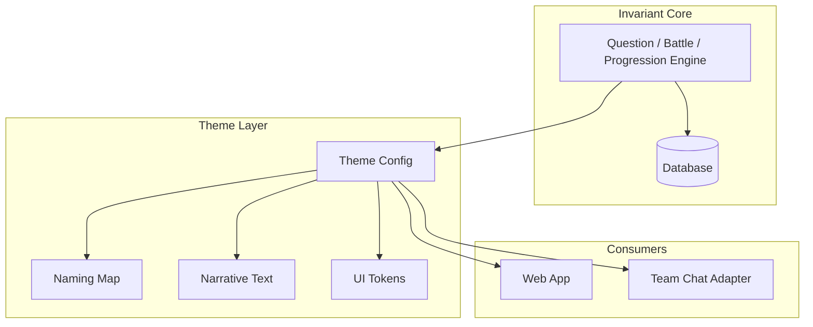
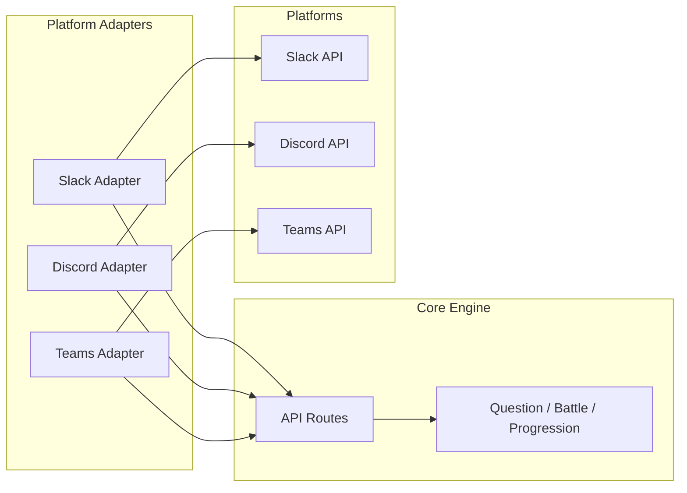

# Phase 0 Design Lock

This document locks the core design decisions for Legendary Hunts. It ensures the game can support multiple themes (Fantasy, Cyberpunk, Naval) and multiple team-chat platforms (Slack, Discord, Teams) without rebuilding. The core engine, gameplay, and processes are invariant; only presentation and delivery layers vary.

---

## 1. Difficulty and Attack Type Model

### Tier Semantics

| Tier | Use | Attack Type | Notes |
|------|-----|-------------|-------|
| 1 | Regular gameplay | Light | Easiest questions |
| 2 | Regular gameplay | Medium | |
| 3 | Regular gameplay | Heavy | |
| 4 | Regular gameplay | Ultimate | Earned after reaching subject mastery level |
| 5 | Labs only | (lab outcome) | Subject-closing, map-closing; `guided_lab` question type |

- **Regular battles:** Questions use tiers 1-4. Attack type maps 1:1 to tier (1=light, 2=medium, 3=heavy, 4=ultimate).
- **Labs:** Tier 5 only. `question_type = 'guided_lab'`. Ultimate test of a subject; not used in normal 4-question encounters.

### Mapping

- `ATTACK_BY_TIER`: `{ 1: "light", 2: "medium", 3: "heavy", 4: "ultimate" }` — single source of truth in `packages/config`.

---

## 2. Modular Theme / Lore Architecture

The game engine is theme-agnostic. Lore (Fantasy Monster Hunter, Cyberpunk, Naval warfare, etc.) can be swapped without changing core logic.

### Invariant vs Themable

| Layer | Invariant (never change with theme) | Themable (driven by theme config) |
|-------|------------------------------------|-----------------------------------|
| **Core Engine** | Question selection, answer evaluation, battle resolution, progression | — |
| **Game Math** | XP/level curve, damage/HP rules | — |
| **Data Model** | Schema, relations, IDs | — |
| **Presentation** | — | Naming, narrative text, UI labels |
| **Visuals** | — | Imagery, colors, fonts, spacing |

### Theme Abstraction Contract

A theme must satisfy:

1. **Naming map** — Maps internal keys to display strings (e.g. `xp` → "XP", "credits", "skill points")
2. **Narrative templates** — Parameterized strings (e.g. "You defeated the {enemy}!" vs "Target neutralized")
3. **UI tokens** (optional for MVP) — Colors, typography, spacing for consistent theming

### Future Implementation Path

- Introduce `packages/theme` or `packages/config/theme.ts` with a theme interface.
- MVP uses default "fantasy" theme; no implementation required now, only the documented contract.
- Later: add Cyberpunk, Naval, etc. as theme configs implementing the same interface.

### Architecture



---

## 3. Team Chat Integration Abstraction

The game should work with Slack, Discord, or Microsoft Teams. The core logic is platform-agnostic; adapters handle platform-specific messaging and events.

### Platform-Agnostic Contract

**What the game needs:**

- Send message (question, feedback, notifications)
- Receive interaction (button click, command)
- Resolve user identity (platform user ID → internal user ID)
- Deep link to web app

**What varies per platform:**

- Slack Block Kit vs Discord embeds vs Teams Adaptive Cards
- OAuth flows and scopes
- Event shapes and payloads
- Rate limits and API quirks

### Adapter Pattern

A `TeamChatAdapter` interface should provide:

- `sendMessage` — Deliver formatted content to the user/channel
- `onInteraction` — Handle button clicks, commands, shortcuts
- `resolveUser` — Map platform user ID to internal `user.id`
- `buildDeepLink` — Generate platform-specific URL to web app

| Platform | Status | Implementation |
|----------|--------|-----------------|
| Slack | Current | `apps/slack` (Bolt, listeners) |
| Discord | Future | New adapter, same interface |
| Teams | Future | New adapter, same interface |

### Current vs Target

| Aspect | Current | Target |
|--------|---------|--------|
| Auth | `slackUserId` used directly | `(platform, platformUserId)` → `user.id` via adapter |
| API routes | Accept `slackUserId` | Accept generic identity, resolve via auth layer |
| Messaging | Slack Block Kit only | Adapter renders platform-specific format |

### Architecture



---

## 4. Unified Encounter Model

**One loop, multiple interaction types.** All gameplay flows as a sequence of encounters. See [ENCOUNTER_MODEL.md](ENCOUNTER_MODEL.md) for full spec.

### Encounter Types

| Type | Use |
|------|-----|
| `question` | Single-question encounter (immediate feedback) |
| `puzzle_step` | Multi-step encounter (partial/staged feedback) |
| `lab_step` | Lab chain step (cumulative feedback) |

### Flow

```
Encounter → Encounter → Encounter → Encounter
```

The engine decides what comes next. Battles operate on **encounters**, not just questions.

### Puzzles and Labs

- **Puzzle:** `{ steps: Encounter[] }` — each step is an encounter
- **Lab:** `{ steps: Encounter[], completion_condition }` — longer encounter chain

No separate UI modes. Same shell, same interaction pattern. Depth increases via chain length and mix.

### Tier 5 Rule (unchanged)

- Tier 5 = lab depth only
- NEVER random; ALWAYS intentional; ALWAYS chain-based
- No "Entering Lab Mode" — encounter chain increases in complexity

### Chain System

```ts
chain_id?: string
chain_position?: number
chain_length?: number
```

---

## 5. Phase 0 Complete Checklist

- [x] Difficulty model: 1-4 gameplay, 5 labs
- [x] Attack mapping: 1=light, 2=medium, 3=heavy, 4=ultimate
- [x] Schema: `difficulty_tier` allows 1-5 (tier 5 for `guided_lab` only)
- [x] Question engine: Regular battles exclude tier 5
- [x] Battle routes: `chosen_attack` derived from `difficulty_tier`
- [x] Modular theme: Documented contract for future implementation
- [x] Team chat abstraction: Documented adapter contract for future implementation
- [x] Unified Encounter model: one loop, encounter types (question/puzzle_step/lab_step), chain system

---

*Source: Phase 0 Design Lock plan*
